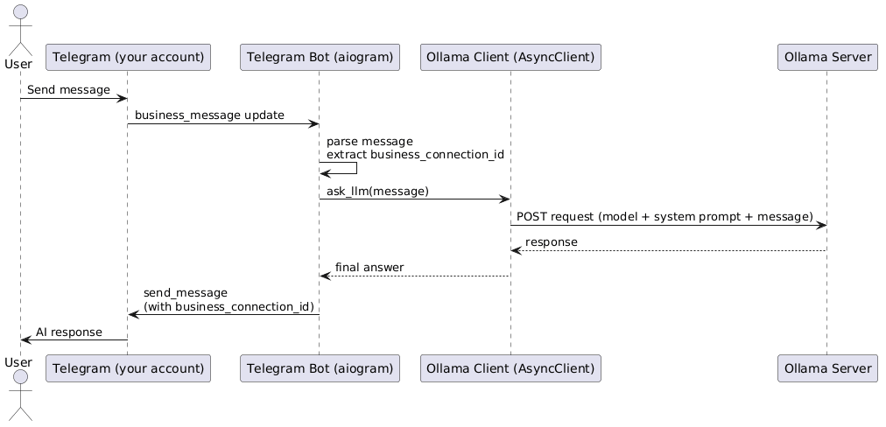

# telegram-chat-automation

A local AI-powered Telegram Business Bot that uses Ollama and a Large Language Model (LLM)
to automatically respond to messages through Telegram Business Connections.

The project is designed to be simple, self-hosted, extensible, and privacy-friendly.
All inference runs locally on your own machine without relying on external AI APIs.

## Featuress

- 🤖 Telegram [Secretary Bot](https://core.telegram.org/bots/features#secretary-bots) support (Chat Automation)
- 🧠 Local LLM inference via Ollama
- 📜 Custom system prompts using Markdown
- 🐳 Docker-based deployment
- 💬 Automatic replies in personal chats
- ⌨️ Typing indicator while generating responses
- 🔒 Fully self-hosted
- 🚀 Extensible architecture for future skills and tools

## How it works



## Requirements

- [Docker](https://docker.com) >=28.1.1
- [Docker Compose](https://docs.docker.com/compose/)
- [Python](https://python.org) >=3.11.2
- [aiogram](https://aiogram.dev/)
- [Ollama](https://ollama.com/)

## Installation

### 0. Create Telegram bot

Go to [BotFather bot](https://t.me/BotFather) and follow provided instructions

### 1. Clone the repository

```bash
git clone https://github.com/shablin/telegram-chat-automation.git
cd telegram-chat-automation
```

### 2. Configure environment variables

Create a `.env` file from `.env.example`:

```env
BOT_TOKEN=your_bot_token

OLLAMA_URL=http://ollama:11434
OLLAMA_MODEL=ollama_model_name
OLLAMA_TIMEOUT=model_response_timeout
```

### 3. Start Ollama

```bash
docker compose up -d ollama
```

### 4. Download a model

Example:

```bash
docker exec -it ollama_sevice ollama pull qwen2.5:7b
```

Verify:

```bash
docker exec -it ollama_sevice ollama list
```

### 5. Start the bot

```bash
docker compose up -d --build
```

## Customizing the bot

The bot behavior is defined in:

```text
bot/prompts/system.md
```

> [!IMPORTANT]
> The contents of this file are injected into every conversation as the system prompt.

## Supported Models

Any Ollama-compatible model can be used.

Recommended:

- qwen2.5:3b
- qwen2.5:7b
- qwen3:4b
- mistral:7b
- deepseek-r1

You can change the model in `.env`:

```env
OLLAMA_MODEL=qwen2.5:7b
```

## Development

View logs:

```bash
docker compose logs -f bot
```

Check Ollama:

```bash
docker compose logs -f ollama
```

Open a shell inside the bot container:

```bash
docker exec -it telegram_bot sh
```

Open a shell inside the Ollama container:

```bash
docker exec -it ollama_sevice sh
```

## Roadmap

- [ ] Conversation memory
- [ ] Skill system
- [ ] Tool calling
- [ ] Streaming responses
- [ ] Multi-model routing
- [ ] Vector search (RAG)
- [ ] User profiles
- [ ] Conversation analytics
- [ ] Plugin system

## Security

This project executes all AI inference locally.
No messages are sent to third-party AI providers unless you explicitly modify the source code.
Always review prompts, tools, and future integrations before deploying the agent in production environments.